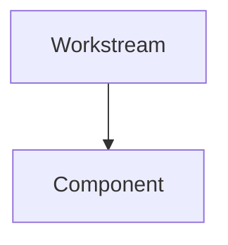

# Design Document - eks-module-upgrade

## Overview & Goals

## Architecture

```mermaid
graph TD
    A[Workstream] --> B[Component]
```

## Tech Stack & Decisions

## Data Models / APIs

## Non-functional Requirements

