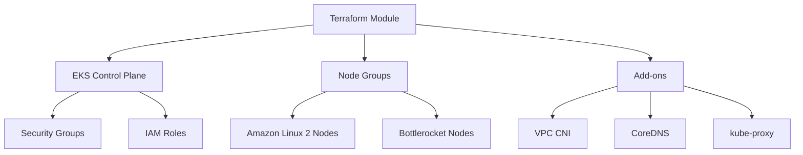

# Design Document - jeppesen-eks

## Overview & Goals
Production-ready EKS module that provides standardized Kubernetes clusters with multiple OS support, automated updates, and enterprise security controls.

## Architecture

## Tech Stack & Decisions
- **Terraform/OpenTofu**: Infrastructure as Code
- **AWS EKS**: Managed Kubernetes service
- **Amazon Linux 2**: Default worker node OS
- **Bottlerocket**: Container-optimized OS option
- **Managed Node Groups**: AWS-managed worker nodes

## Data Models / APIs
- EKS cluster configuration via Terraform variables
- Node group specifications with OS selection
- Security group and IAM role definitions
- Add-on configurations

## Non-functional Requirements
- **Security**: Pod security standards, network policies
- **Scalability**: Auto-scaling node groups
- **Reliability**: Multi-AZ deployment, health checks
- **Maintainability**: Automated updates, clear documentation