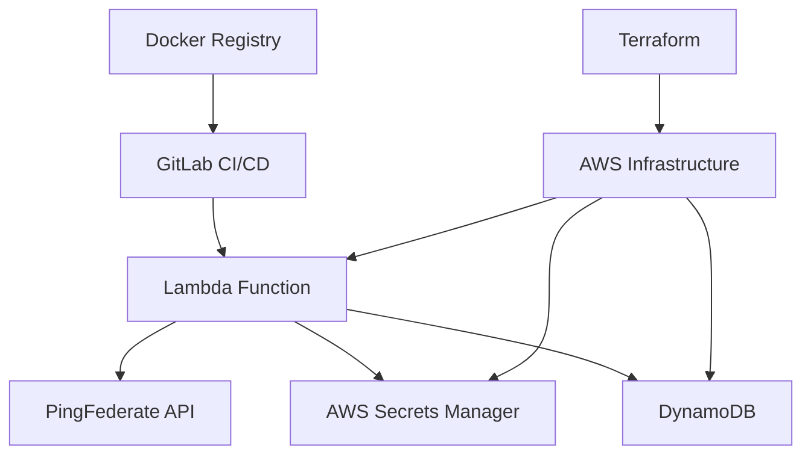

# Design Document - ocm-client

## Overview & Goals
Automated OAuth client management system that provides self-service client provisioning through Lambda functions with PingFederate integration and secure credential management.

## Architecture


## Tech Stack & Decisions
- **AWS Lambda**: Serverless execution environment
- **Python 3.11**: Runtime with MSAL and requests libraries
- **Terraform**: Infrastructure as Code
- **Docker**: Containerized Lambda deployment
- **GitLab CI/CD**: Automated deployment pipeline
- **PingFederate**: OAuth authorization server

## Data Models / APIs
### Lambda Handler Input
```json
{
  "clientId": "string",
  "clientName": "string", 
  "description": "string",
  "enabled": true,
  "redirectUris": ["array"],
  "grantTypes": ["array"],
  "scopes": ["array"]
}
```

### PingFederate Client Payload
```json
{
  "clientId": "string",
  "name": "string",
  "description": "string",
  "clientAuth": {"type": "SECRET"},
  "restrictToDefaultAccessTokenManager": true
}
```

## Non-functional Requirements
- **Security**: Encrypted credential storage, secure API communication
- **Reliability**: Error handling, retry logic, state persistence
- **Scalability**: Concurrent client provisioning support
- **Maintainability**: Comprehensive logging, monitoring